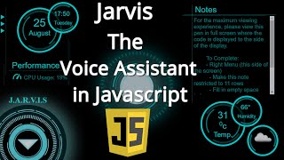

# Jarvis-in-Javascript🚀🚀

Welcome everyone..🙏🙏

✔️ To get started with project download this repo and follow below steps accordingly:
step 1: 
      Download repo...
step 2: 
      Open the folder with vscode code editor...
step 3:
      Now visit this website 👉https://openweathermap.org/appid create your account and get api key.
	⚠️⚠️ Please get your 👉API_KEY prior otherwise project won't work...
      This will help you to get weather details for your area...
step 4: 
      Now open index.html file in root directory with live server extension in VScode...

Here you go... you have succefully setup your JARVIS 👏👏

**Note:**
✔️ To add additional function:
      Create a function in app1.js file which is available at mic/app1.js for example
      function createAlarm(){
          // Write some code
      }
      And then call this function in process.json with it's respective command for example...
      // In process.json
      {
      "Jarvis set an alarm" : "createAlarm()"
      }
      
✔️ Please allow the necessary permission required to perform certain task like
    camera permission for taking pictures,location for weather details, etc...
    
✔️ Sometimes JARVIS starting message/sound does not come so click on center so new small JARVIS window will come and then press 'ctrl+s' in 
    vscode this is quite annoying but this will solve issue...

Hopefully now you will be able to setup your project but still if you face any issue comment down in video section I will be happy to help you...
